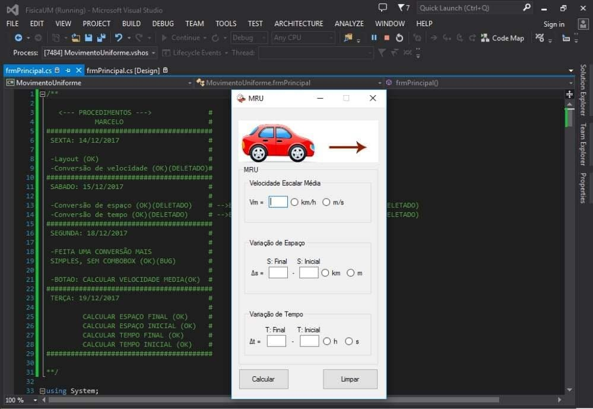

      

------

<h1>
    Bem-vindo!
    </h1>  

------

##### Eu sou Marcelo! 

Atualmente estou cursando Análise & Desenvolvimento De Sistemas  [(ADS](https://www.guiadacarreira.com.br/carreira/analise-e-desenvolvimento-de-sistemas/)) na Universidade Católica Do Salvador ([UCSal](https://www.ucsal.br))  __  2020.1 - 2020.3

Tenho conhecimento e experiência prática com lógica de programação, poo.

Já desenvolvi alguns projetos em [C#](https://pt.wikipedia.org/wiki/C_Sharp), em 2018, enquanto frequentava um curso profissionalizante, de programação, na [Microlins](https://www.microlins.com.br). Porém, fiquei sem acesso a um computador pessoal para praticar as lições dadas durante esse período e acabei esquecendo de alguns assuntos por falta de prática.

*Screenshot de um projeto pessoal que eu desenvolvia nas horas livres do curso:*

Bem como, também, comecei a desenvolver um jogo simples, no celular, porém inacabado, inspirado no clássico MMORPG [Tibia](https://www.tibia.com/news/?subtopic=latestnews), no final 2019, usando [Pygame](https://www.pygame.org/news), que é uma biblioteca de jogos multiplataforma para [Python](https://www.python.org):

------

<h1>
    Objetivos
    </h1>  

Estudar e praticar, tecnologias da linguagem de programação [Java](https://pt.wikipedia.org/wiki/Java_(linguagem_de_programação)), que é a principal linguagem de ensino do curso de [ADS](https://www.guiadacarreira.com.br/carreira/analise-e-desenvolvimento-de-sistemas/), a fim de desenvolver o meu portfólio e ingressar no mercado de trabalho.

:footprints: **Médio/Longo Prazo**

- Full-Stack
- Back-End
- Desenvolvimento mobile

<h1>
    Estudos - Log
    </h1>  

      

------

**`Anteriores:`**

 Raciocínio Lógico -  Inglês Técnico

 Lógica de Programação e Algoritmos

**`Atuais:`**

 Programação orientada a objetos

 Estrutura de dados -  Governança

 Arquitetura e organização de computadores

**`Futuros:`**

 Banco de Dados

 Programação Web

------

- [x] Disponível para oportunidades de *Dev Jr*

------

